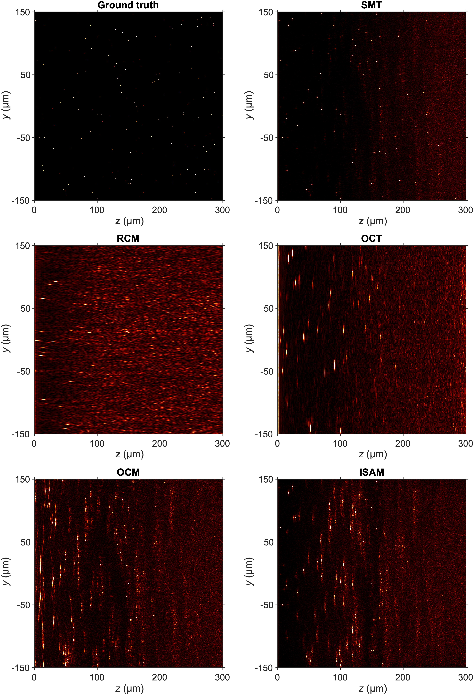
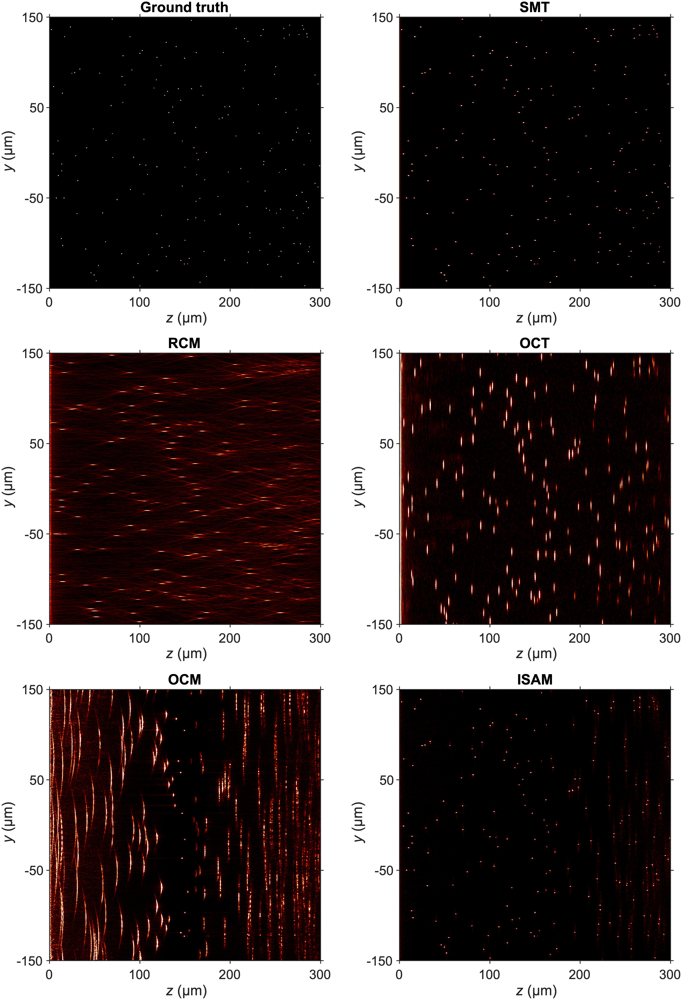

# Imaging simulations

## Introduction
This repository contains the code for [this paper](https://arxiv.org/abs/2308.07244) that performs large-scale full-wave simulations of scattering-based imaging methods:

- Scattering Matrix Tomography ([SMT](https://arxiv.org/abs/2306.08793))
- Reflectance Confocal Microscopy (RCM)
- Optical Coherence Tomography (OCT)
- Optical Coherence Microscopy (OCM)
- Interferometric Synthetic Aperture Microscopy (ISAM)

We use the scattering matrix to perform numerical modeling. The scattering matrix encapsulates the sample’s complete linear response. Given the scattering matrix of the sample, we can obtain the scattering field from arbitrary input and model any scattering-based imaging method. The computation of scattering matrices is accelerated by several orders-of-magnitude thanks to the introduction of a new technique called [augmented partial factorizaion](https://www.nature.com/articles/s43588-022-00370-6), making it possible to perform the full-wave simulation on a large system. Such numerical modeling can be helpful for developing new imaging methods by providing the ground truth, the flexibility to tailor the system and the imaging scheme, and the ease of comparing different methods.

## Installation

The code is written in MATLAB so no compilation is required. Simply download the source code and add all the folders to the MATLAB search path. Make sure that the working directory is ```/path/to/Imaging-simulations``` when you run the code.

The following package or software is required for running some components of the code:
- MATLAB (R2023b or later is preferred)
- [MESTI](https://github.com/complexphoton/MESTI.m): required for the reflection matrix computation using APF. No need for the image reconstruction or other components.

The following packages are optional. They can accelerate the scattering matrix computation or image reconstruction.

- [METIS](http://glaros.dtc.umn.edu/gkhome/metis/metis/download): a package for producing high-quality orderings for matrix factorization, which accelerates the scattering matrix computation. For the systems considered in the paper, the computation time is shorten by about 20%.
- [FINUFFT](https://github.com/flatironinstitute/finufft): a package that implementes non-uniform fast Fourier transforms (NUFFTs). We need NUFFTs for image reconstruction. MATLAB also implements its own NUFFT function in R2020a and improve the performance in R2022a and R2023b. The code will use MATLAB's nufftn() if FINUFFT is not installed. 

## Getting Started
To get started, we suggest running the image reconstruction code for the system described in our paper. After downloading the precomputed reflection matrix, ```system_data.mat``` file and moving them to ```Image-simulations/data/large_system```, you can use  ```recon_all.m``` to reconstruct all images. Before running the script, make sure that the working directory is ```/path/to/Imaging-simulations``` and all scripts are in the MATLAB search path. It takes less than one minute to reconstruct each image on a MacBook Air with Apple M1 chip.  

After obtaining the reconstructed images, you may download the z-dependent weights and use the ```scripts/plotting/plot_all_images.m``` to plot all images.

In addition, we upload a small system example where all computation can be done on a local machine. The total computation time for the reflection matrix is about 15 mins on a MacBook Air with Apple M1 chip. The image reconstruction takes a few seconds.

## Usage

Here, we give an overview of the functionality and usage of all components. For more detailed information, please refer to comments at the beginning of each script. 

### System Setup
This component (```Imaging-simulations/scripts/system_setup```) builds the system and outputs a ```system_data.mat``` file, which contains all the necessary data for reflection matrix computation and image reconstruction. In addition, it also outputs METIS ordering files if METIS is installed and the option of producing METIS orderings is set to true.

To build the system, you should first create a directory 
```data_dir``` and a script ```data_dir/set_simulation_parameters.m```. All the simulation parameters shall be defined in that script. You can use our sample systems as the template. The ```data_dir``` will be used later for saving all simulation data of this system, including the reflection matrices and reconstructed images. In this repository, we use ```data_dir=Imaging-simulations/data/[system_name]```. After defining the parameters, you can specify your ```data_dir``` in ```build_system.m``` and run the script. The script builds the system and saves all relevant data in ```data_dir/system_data.mat```. It also saves optional METIS ordering files under ```data_dir/orderings```.


### Reflection Matrix Computation

This component (```Imaging-simulations/reflection_matrix_computation```) computes hyperspectral angular/spatial reflection matrices. There are three scripts in this componenet. The ```compute_angular_R.m``` computes angular reflection matrices at multiple frequencies while ```compute_spatial_R.m``` computes a subset of the spatial reflection metrics at multiple frequencies. The ```planckwin.m``` is used for generating a Planck-taper window profile for smoothing the line source profile.

The R computation function loads necessary data from ```system_data.mat``` and the METIS orderings if exist.  After the computation is done, the reflection matrix will be saved under ```data_dir/hyperspectral_reflection_matrices```. Note that reflection matrices are converted to single-precision for reducing the storage space and accelerating the image reconstrcution speed. 

### Image Reconstruction

This component (```Imaging-simulations/image_reconstruction```) consists of functions for reconstructing images from hyperspectral reflection matrices. Each function implements one or two imaging methods menitioned in the introduction section. 

To use those functions, you need to specify the data directory ```data_dir``` and/or the imaging method in the arguments. The function will load necessay data from ```data_dir/system_data.mat``` and reflection matrices from ```data_dir/hyperspectral_reflection_matrices```, reconstruct the image, and save the reconstructed image data under ```data_dir/reconstructed_images```. Note that the image data is saved in single-precision, which is sufficient for most imaging applications. 


### Post-processing

This component (```Imaging-simulations/depth_dependent_weights```) generates depth-dependent weights for reducing the intensity variation across different image depths. The weight is an exponential function of a piecewise polynomial. The polynomial coefficients are determined by manual tuning to fit the maximum image intensity at each depth. 

The weight parameters for all images are defined in ```data_dir/z_z_dependent_weights/get_weight_parameters```. You specify the imaging method in the script. The script will generate the weight and plot the weight and the maximum image intensity at each depth. As a rule of thumb, you should tune the weight parameters such that trend of both curves matches. You can specify the option of saveing the weight to true after the tunning. The weight will be saved under ```data_dir/z_dependent_weights```.

### Field profile computation

This component (```Imaging-simulations/field_profile_computation```) contains the script for computing field profiles with the plane wave or focused Gaussiab beam input. 

### Plotting

This component (```Imaging-simulations/plotting```) consists of some plotting scripts. the ground truth, reconstructed images and field profiles.

You should specify the data directory ```data_dir``` and the list of imaging methods. If you have generated depth-dependent weights for those methods, you can set the option of applying weights to true. The script will load the image data from ```data_dir/reconstructed_images```, divide the image intensity by the depth-dependent weight if applicable, and plot the images. It also plots the ground truth if you includes "ground_truth" in the list of imaging methods. By setting the option of saving figures to true, you can save the JPEG image under ```Imaging-simulations/figs/[system_name]```. 

## Results
In this section, we show some image reconstruction results.

### The large system


### The weakly scattering system


